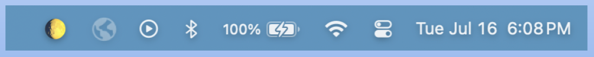

[](https://swiftpackageindex.com/mannylopez/TinyMoon)
[](https://swiftpackageindex.com/mannylopez/TinyMoon)
[](https://swift.org/package-manager)


# Tiny Moon Swift Package

A tiny Swift library to calculate the moon phase for any given date, works super fast, and works completely offline.

Compatible with iOS and MacOS.

## Quick start

```swift
// Get the moon phase for right now
let moon = TinyMoon.calculateMoonPhase()
```

## Installation
1. Open your existing Xcode project or create a new one
2. Open the Swift Packages Manager
	- In the project navigator, select your project file to open the project settings.
	- Navigate to the the **Package Dependencies** tab
3. Add the Tiny Moon Package
	- Click the **+** button at the bottom of the tab
	- In the dialog box that appears, enter the URL for Tiny Moon: `https://github.com/mannylopez/TinyMoon.git`
4. Specify version rules
	- Xcode will prompt you to specify version rules for the package. "Up to Next Major Version" ensures compatibility with future updates that don't introduce breaking changes.
	- Click **Add Package**


## Usage
Now that Tiny Moon is added to your project, import it and simply pass in the the `Date` and `TimeZone` for which you'd like to know the Moon phase for. If no date is passed in, then your system's current `Date` will be used.

*An example app using Tiny Moon*

```swift
import SwiftUI
import TinyMoon

struct SimpleMoonView: View {

  private let moon = TinyMoon.calculateMoonPhase()

  var body: some View {
    VStack(spacing: 16) {
      Text(moon.date.toString())
      Text(moon.emoji)
      Text(moon.name)
      Text("Illumination: \(moon.illuminatedFraction)")
      Text("\(moon.ageOfMoon.days) days, \(moon.ageOfMoon.hours) hours, \(moon.ageOfMoon.minutes) minutes")
      Text("Full Moon in \(moon.daysTillFullMoon) days")
      Text("New Moon in \(moon.daysTillNewMoon) days")
    }
  }
}

#Preview {
  SimpleMoonView()
}
```


## API

#### Entry point
The main entry point into the library is the [`TinyMoon`](https://github.com/mannylopez/TinyMoon/blob/main/Sources/TinyMoon/TinyMoon.swift) name space.

From there, you can access func's `calculateMoonPhase` and `calculateExactMoonPhase`

```swift
public enum TinyMoon {
  public static func calculateMoonPhase(
    _ date: Date = Date(),
    timeZone: TimeZone = TimeZone.current)
    -> Moon
  {
    Moon(date: date, timeZone: timeZone)
  }

  public static func calculateExactMoonPhase(_ date: Date = Date()) -> ExactMoon {
    ExactMoon(date: date)
  }
}

```

#### `Moon` vs `ExactMoon`

The `Moon` object prioritizes the major phases (new moon, first quarter, full moon, last quarter) if it happens to land within a specific day.

The `ExactMoon` object always returns the exact values for the specific date and time passed in.

For example, given that the full moon occurs on `August 19, 2024 at 13:25 UTC` 

```swift
import Foundation

// The Date we will query for is August 19, 2024 at 02:00 UTC
let isoFormatter = ISO8601DateFormatter()
isoFormatter.timeZone = TimeZone(secondsFromGMT: 0)
let date = isoFormatter.date(from: "2024-08-19T02:00:00Z")!

let moon = TinyMoon.calculateMoonPhase(date, timeZone: isoFormatter.timeZone) // If you don't specify a TimeZone, it will default to the system's TimeZone
print(moon.name)	// Full Moon
print(moon.emoji)	// 🌕

let exactMoon = TinyMoon.calculateExactMoonPhase(date)
print(moon.name)	// Waxing Gibbous
print(moon.emoji)	// 🌔
```

`ExactMoon` will return `.waxingGibbous` because that is a more accurate representation of the moon phase at `02:00 UTC` time. `Moon` will return `.fullMoon` since a Full Moon happens during that day.

#### Moon properties

| Property | Type | Description |
| -- | -- | -- |
| moonPhase | MoonPhase | Enum with all 8 moon phases |
| name | String | String representation of MoonPhase case |
| emoji | String | Emoji for moon phase |
| date | Date | Date passed in for the Moon object |
| julianDay | Double | Continuous count of day since the beginning of Julian period. Used in astronomical calculations ([wikipedia](https://en.wikipedia.org/wiki/Julian_day)) |
| daysTillFullMoon | Int | Returns `0` if the current `date` is a full moon |
| daysTillNewMoon | Int | Returns `0` if the current `date` is a new moon |
| daysElapsedInCycle | Double | Number of days elapsed into the synodic cycle, represented as a fraction |
| ageOfMoon | (days: Int, hours: Int, minutes: Int) | Age of the moon in days, minutes, hours |
| illuminatedFraction | Double | Illuminated portion of the Moon, where 0.0 = new and 1.00 = full |
| phaseFraction | Double | Phase of the Moon, represented as a fraction. See table below. |
| distanceFromCenterOfEarth | Double | Distance of moon from the center of the Earth, in kilometers |
| fullMoonName | String? | Returns the coloquial full moon name |

Values for `phaseFraction` and corresponding emoji

| phaseFraction | Name | Emoji |
| -- | -- | -- |
| 0.0 | New Moon | 🌑 |
|| Waxing Crescent | 🌒 |
| 0.25 | First Quarter | 🌓 |
|| Waxing Gibbous | 🌔 |
| 0.5 | Full Moon | 🌕 |
|| Waning Gibbous | 🌖 |
| 0.75 | Last Quarter | 🌗 |
|| Waning Crescent | 🌘 |

## Demos
The following are built with this Tiny Moon Swift Package

#### MacOS

A MacOS app (available in the [App Store](https://apps.apple.com/us/app/tiny-moon/id6502374344)) that displays the current moon phase as an emoji in your toolbar.

Source code: https://github.com/mannylopez/TinyMoonApp




#### iOS

A simple iOS app to showcase how to use Tiny Moon Swift Package

Source code: https://github.com/mannylopez/TinyMoonMobile


## Appreciation

Big thank you to [suncalc](https://github.com/mourner/suncalc), a tiny JavaScript for calculating the moon position and lunar phase for the given time (sun position and sunlight phases as well). It helped me understand the underlying formulas needed for calculating the moon phase.

Great resources I found via suncalc include, but are not limited to:

- [Astronomy Answers Positions in the Sky](https://aa.quae.nl/en/reken/hemelpositie.html)
- NASA's [IDL Astronomy User's Library](https://github.com/wlandsman/IDLAstro/blob/master/pro/mphase.pro)

A big big thank you to John Walker who wrote [Moontool for Windows](https://www.fourmilab.ch/moontoolw/) and released the C source code into the public domain. This is where the main formula for calculating the moon phase comes from, and I've found it to be extremely accurate.